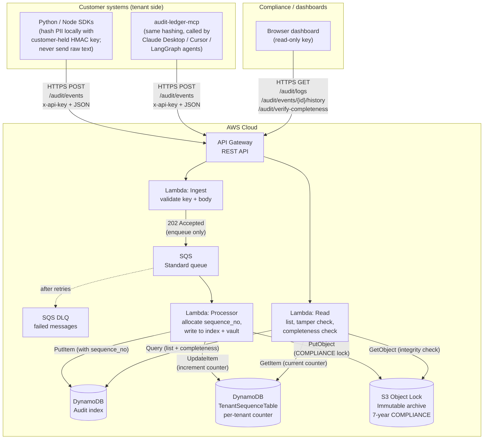
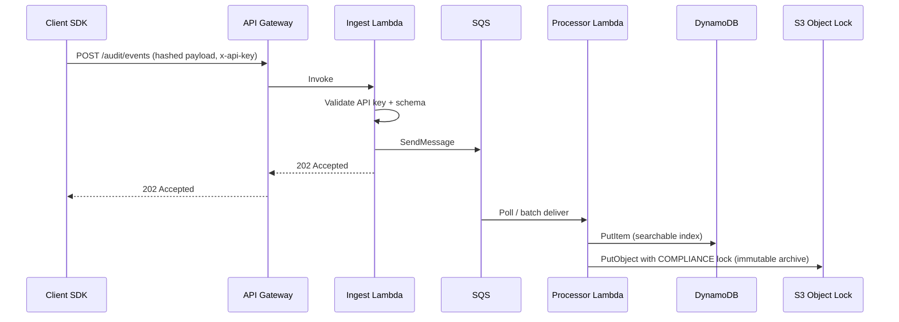
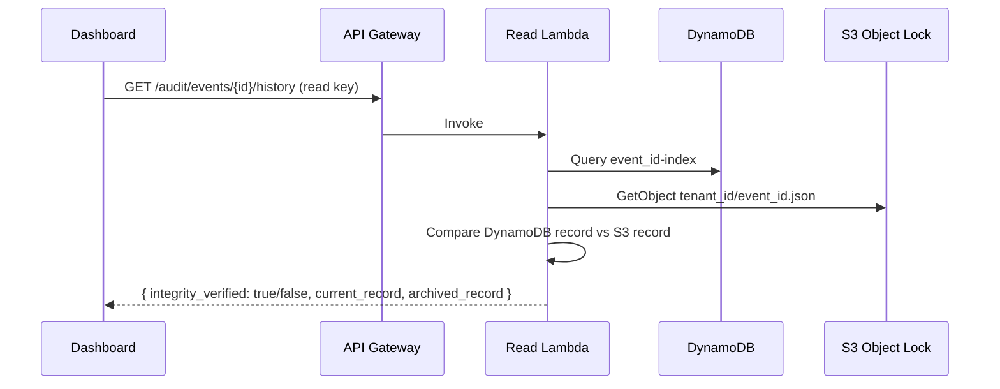

# AI Audit Ledger — Setup and architecture

This document explains **how the system is set up** (what exists, where it lives, and how it fits together) and includes the **architecture diagrams**. For a **plain-English-only** walkthrough of each piece (no diagrams), see [LAYMAN-GUIDE.md](./LAYMAN-GUIDE.md). For step-by-step **deployment commands**, see [DEPLOYMENT.md](./DEPLOYMENT.md).

**Project folder on your machine:** `C:\Users\AI Data Logger\ai-audit-ledger`

---

## 1. What "the setup" is, in plain English

**AI Audit Ledger** is a small cloud application made of:

1. A **web front door** (API Gateway) that speaks HTTPS.
2. A **fast intake lane** (ingest Lambda + queue) so customers get a quick "yes, received" answer while saving is finished in the background.
3. A **searchable index** (DynamoDB) for listing and filtering records by date, tenant, or event ID.
4. A **permanent sealed vault** (S3 with Object Lock) where every record is locked and cannot be modified or deleted for 7 years — the legally defensible tamper-evidence layer.
5. A **read path** (read Lambda) so compliance tools or dashboards can list events and run tamper-evidence checks by comparing the DynamoDB record against the locked S3 original.

You **deploy** this setup into your **AWS account** using the **CDK** project under `infra\cdk`. Until you deploy, nothing runs in the cloud — the folder on your PC is only the **recipe** and **code**.

---

## 2. What lives in the project folder

| Location | Role |
|----------|------|
| `schemas\` | Definitions of the JSON body (TypeScript + Python) so everyone agrees on field names and rules. |
| `sdk\python\` | Python helper: hash sensitive text locally with the customer's HMAC key (v0.3+; falls back to plain SHA-256 if unset), send events to the ingest URL. |
| `sdk\nodejs\` | Node helper: same idea for JavaScript servers. |
| `infra\cdk\` | **Infrastructure as code**: tells AWS how to create API Gateway, queues, Lambdas, DynamoDB tables (including the `TenantSequenceTable` from v0.3+), and S3 bucket. |
| `infra\cdk\lambda\` | The actual **ingest**, **processor**, and **read** program code that runs in AWS, plus shared libraries for hashing, sequence allocation, and completeness computation. |
| `dashboard\` | Static HTML dashboard — open in any browser, no install needed. |
| [DEPLOYMENT.md](./DEPLOYMENT.md) | Lay-friendly **how to deploy** instructions. |
| [GETTING-STARTED.md](./GETTING-STARTED.md) | Step-by-step setup from scratch (AWS account, Node.js, AWS CLI). |

---

## 3. What gets created in AWS when you deploy

| Piece | Everyday name | What it does |
|-------|----------------|--------------|
| **API Gateway** | The public web address for your API | Routes **POST** (ingest) and **GET** (read) to the right Lambda. |
| **Ingest Lambda** | The "receiver" | Checks the **tenant API key** and the JSON shape, then puts a message on the queue. Returns **202 Accepted** without waiting for the database. |
| **SQS queue** | A waiting line | Holds work so spikes do not overload the storage write path. |
| **Processor Lambda** | The "writer" | Takes messages from the queue, allocates a per-tenant sequence number (v0.3+), and writes each event to **DynamoDB** (index) and **S3** (immutable archive). |
| **Dead-letter queue (DLQ)** | A side tray | If a message fails too many times, it lands here for someone to inspect. |
| **DynamoDB (audit table)** | The searchable index | Stores all records in a queryable form — filter by date, tenant, or look up a specific event ID. |
| **DynamoDB (tenant sequence table)** | The per-tenant counter (v0.3+) | Holds a monotonic counter per tenant so the read path can detect any missing records. |
| **S3 bucket (Object Lock)** | The permanent sealed vault | Every record written here is locked in COMPLIANCE mode — cannot be modified or deleted for 7 years, even by the account root. This is the tamper-evidence guarantee. |
| **DynamoDB (rate limit table)** | Request counter | Tracks how many requests each customer has made per minute to enforce rate limits. |
| **Read Lambda** | The "reader" | Answers **GET** requests: list logs, run tamper-evidence checks (compares DynamoDB and locked S3 copies of one record), and from v0.3 also runs completeness checks (compares the per-tenant counter against records actually present and returns any missing sequence numbers). |
| **Secrets Manager** | The key vault | Stores API keys securely. Keys are never exposed in config files or environment variables. |

**Two different passwords (API keys):**

- **Tenant key** — Given to each **customer** who **sends** audit events.
- **Read key** — For **your team** or **dashboard** that only **reads** logs. A read key can be scoped to one tenant or granted admin access to all tenants.

---

## 4. High-level architecture diagram

**How to read it**

- **Left (SDKs and MCP):** Customer systems either call the SDK from their own code, or run the MCP server as a child process that their AI agent calls via the Model Context Protocol. Both hash PII on the customer side with the customer-held `AUDIT_HMAC_KEY` (v0.3+) and send only the hashes and the structured decision to your API.
- **Middle (ingest):** API Gateway hands **POST** traffic to the **ingest** Lambda. That Lambda **does not** write to the database; it only **validates** and **enqueues**. That keeps responses fast.
- **Queue → processor:** The **processor** Lambda drains the queue, atomically allocates a per-tenant sequence number from the `TenantSequenceTable` (v0.3+), and writes the stamped record to both DynamoDB and S3. S3 uses Object Lock COMPLIANCE mode, which means records are sealed for 7 years.
- **Right (read):** Compliance tools use **GET** with the **read** key. The tamper-evidence check fetches both copies (DynamoDB + S3) and compares them. The completeness check (v0.3+) compares the per-tenant counter against the records actually present and returns any missing sequence numbers.

---

## 5. Ingest sequence (what happens first, second, third)

The **customer** gets **202** as soon as the message is safely in the queue. The **write to DynamoDB and S3** happens moments later when the processor runs.

---

## 6. Tamper-evidence check sequence

---

## 7. Trust boundaries (who sees what)

| Boundary | What crosses it |
|----------|------------------|
| **Tenant → AWS** | Over the internet: **TLS**. Payload should contain **hashes**, not raw CV text, if tenants follow the SDK pattern. |
| **Ingest → SQS** | The validated JSON for one event. |
| **Processor → DynamoDB** | Record written to the queryable index. |
| **Processor → S3** | Record written with COMPLIANCE Object Lock — sealed for 7 years. |
| **Reader → AWS** | **Read API key** only for **GET**; tamper-evidence responses show whether the DynamoDB and S3 copies match. |

---

## 8. HTTP paths after deploy

Your exact host name comes from the deployment **outputs** (see [DEPLOYMENT.md](./DEPLOYMENT.md)).

| Method | Path (after `/prod/`) | Purpose |
|--------|------------------------|---------|
| POST | `audit/events` | Ingest one event (tenant key). |
| GET | `audit/logs` | List events (read key); optional `from` and `to` date filters. |
| GET | `audit/events/{eventId}/history` | Tamper-evidence check — compares DynamoDB record against S3 archive. |
| GET | `audit/events/{eventId}/status` | Quick "did this event_id land?" check (tenant key or read key). |
| GET | `audit/verify-completeness` | Completeness check (v0.3+). Returns any missing sequence numbers for the calling tenant. Optional `from` and `to` query params to narrow the range. |
| GET, PUT, DELETE | `admin/tenants/{tenantId}/contact` | Admin-only (admin read key). Manage per-tenant email and webhook for failure notifications. |

---

## 9. How setup connects to deployment

- **Architecture** (this file) = *what* you are building and *how data moves*.
- **Deployment** ([DEPLOYMENT.md](./DEPLOYMENT.md)) = *how to install tools*, *run CDK*, and *save the URLs and keys* after AWS creates everything.

Typical order for a new environment:

1. Install Node, AWS CLI, CDK (see [GETTING-STARTED.md](./GETTING-STARTED.md)).
2. Run **bootstrap** once per account/region.
3. Run **deploy** from `infra\cdk`.
4. Copy **outputs** (ingest URL, read URL, secret ARNs, bucket name) to a secure place.
5. Configure customer SDKs with the **ingest URL** and **tenant** keys; configure dashboard with the **read URL** and **read** key.

---

## 10. Where the wiring is defined in code

| What | File |
|------|------|
| Whole AWS setup (API, queues, Lambdas, DynamoDB, S3, Secrets Manager) | `infra\cdk\lib\ai-audit-stack.ts` |
| Ingest handler | `infra\cdk\lambda\ingest.ts` |
| Processor (queue → DynamoDB + S3) | `infra\cdk\lambda\processor.ts` |
| Read handler (list + tamper-evidence check) | `infra\cdk\lambda\read.ts` |
| CDK entry point | `infra\cdk\bin\ai-audit.ts` |

---

## 11. Diagram source

Diagrams use [Mermaid](https://mermaid.js.org/). They render on GitHub, GitLab, and in many editors with a Mermaid preview. If your viewer does not support Mermaid, paste the fenced blocks into [Mermaid Live Editor](https://mermaid.live).
